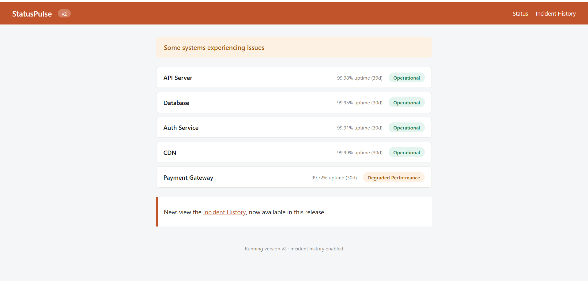
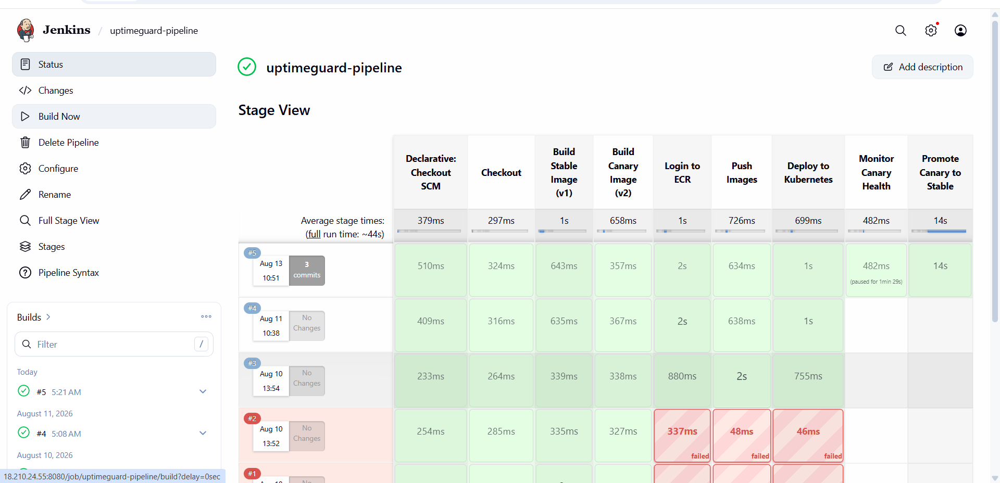
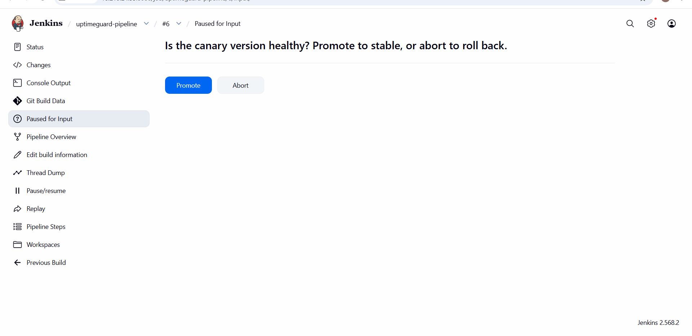
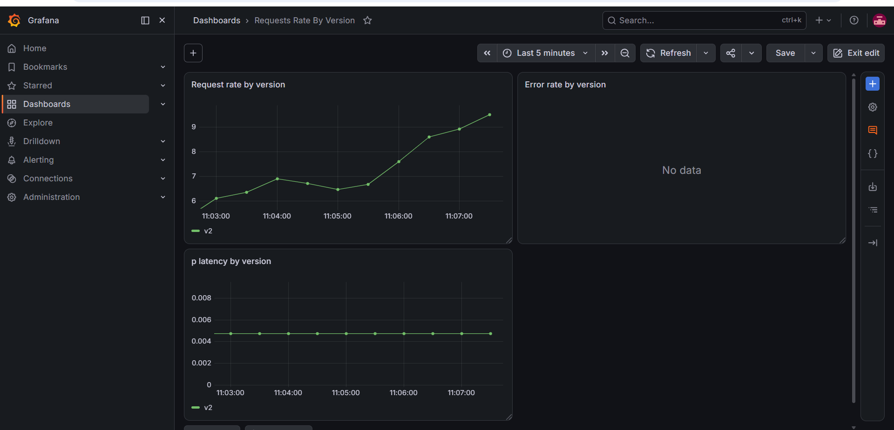
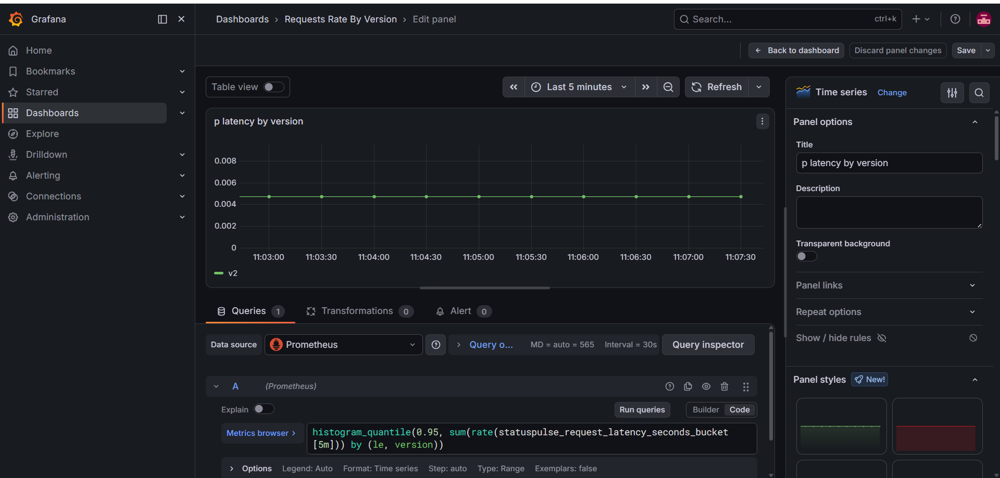

# UptimeGuard

An end-to-end canary deployment pipeline built on self-managed Kubernetes, provisioned entirely through infrastructure-as-code. UptimeGuard deploys two versions of a status-dashboard app side by side — a stable version and a canary — behind a shared Kubernetes Service, with live traffic split between them and real-time monitoring to support a promote-or-rollback decision.

This project was built to go beyond tutorial-level DevOps and actually operate the full lifecycle a production team would: provisioning, configuration, CI/CD, deployment, and observability — including the real infrastructure failures that came with it.

## Architecture

```
                         ┌────────────────────┐
                         │       Users         │
                         └──────────┬──────────┘
                                    │
                          NodePort Service (80:30080)
                                    │
              ┌─────────────────────┴─────────────────────┐
              │                                             │
     ┌────────▼────────┐                          ┌────────▼────────┐
     │  Stable (v1)     │                          │  Canary (v2)     │
     │  4 replicas      │                          │  1 replica       │
     └──────────────────┘                          └──────────────────┘

   Traffic splits ~80/20 across the two Deployments via the shared Service.
```

**Four EC2 instances, each with a distinct role:**

| Instance | Role |
|---|---|
| Jenkins | CI/CD orchestrator — builds Docker images, pushes to ECR, deploys to the cluster |
| K8s Control Plane | Kubernetes API server, scheduler, etcd (kubeadm) |
| K8s Worker 1 | Runs application pods + Prometheus/Grafana |
| K8s Worker 2 | Runs application pods + Prometheus/Grafana |

## Tech stack

- **Terraform** — provisions all 4 EC2 instances, a shared security group, an ECR repository, and an S3 + DynamoDB remote state backend
- **Ansible** — configures each node by role (Jenkins install, Kubernetes prerequisites)
- **Kubernetes (kubeadm, self-managed)** — 1 control plane + 2 workers, Flannel for pod networking
- **Jenkins** — CI/CD pipeline: build both image versions, push to ECR, deploy manifests, gate promotion behind a manual health check
- **Docker** — the application is a single codebase, built twice with different build-args to produce the stable and canary images
- **Prometheus + Grafana** (kube-prometheus-stack via Helm) — scrapes the app's `/metrics` endpoint and visualizes request rate, error rate, and latency, split by version
- **Flask** — the application itself, a status dashboard with a feature flag that's enabled only in the canary build

## How the canary deployment works

The application is built from one codebase but produces two Docker images, differentiated only by build-time environment variables:

- `v1` (stable): `FEATURE_INCIDENTS=false`
- `v2` (canary): `FEATURE_INCIDENTS=true`

Both versions run simultaneously in the cluster under one Kubernetes Service. Because the stable Deployment runs 4 replicas and the canary runs 1, the Service's default round-robin load balancing naturally sends roughly 80% of traffic to the stable version and 20% to canary — a functional traffic split without needing a service mesh.

Prometheus scrapes both versions' `/metrics` endpoints continuously, and a Grafana dashboard shows request rate, error rate, and p95 latency for each version side by side. The Jenkins pipeline pauses after deployment at a manual approval gate — the operator checks the dashboard, then either promotes the canary (its image becomes the new stable, canary scales to zero) or rolls it back (canary scales to zero, stable is untouched, zero user impact).

## Repository structure

```
uptimeguard/
├── Terraform-infra/       # EC2 instances, security group, ECR, S3/DynamoDB backend
│   └── backend/           # Bootstrap config for remote state (run once, separately)
├── ansible/
│   ├── roles/
│   │   ├── common/        # Runs on all nodes
│   │   ├── jenkins/       # Jenkins + Docker install
│   │   └── k8s_prereqs/   # containerd, kubeadm, kubelet, kubectl, kernel prerequisites
│   └── site.yml
├── appfiles/               # The Flask application
├── k8s/                     # Kubernetes manifests (namespace, deployments, service)
└── Jenkinsfile
```

## Setup

**1. Bootstrap remote state (once):**
```bash
cd Terraform-infra/backend
terraform init && terraform apply
```

**2. Provision infrastructure:**
```bash
cd ../
terraform init && terraform apply
```

**3. Configure nodes:**
```bash
cd ../ansible
ansible-playbook -i inventory.ini site.yml
```

**4. Bootstrap the Kubernetes cluster** (manual, on the control plane node):
```bash
sudo kubeadm init --pod-network-cidr=10.244.0.0/16
kubectl apply -f https://raw.githubusercontent.com/flannel-io/flannel/master/Documentation/kube-flannel.yml
```
Then join both workers using the `kubeadm join` command printed by `init`.

**5. Create the ECR pull secret** (expires every 12 hours — re-run as needed):
```bash
kubectl create namespace uptimeguard
kubectl create secret docker-registry ecr-secret \
  --docker-server=<account-id>.dkr.ecr.<region>.amazonaws.com \
  --docker-username=AWS \
  --docker-password=$(aws ecr get-login-password --region <region>) \
  --namespace=uptimeguard
```

**6. Set up Jenkins** — install suggested plugins plus Docker Pipeline, Amazon ECR, and Kubernetes CLI; add the kubeconfig as a Secret file credential (`pulseguard-kubeconfig`); set `ECR_REPO` and `AWS_REGION` as global environment variables.

**7. Install monitoring:**
```bash
helm install monitoring prometheus-community/kube-prometheus-stack \
  --namespace monitoring --create-namespace \
  --set grafana.service.type=NodePort --set grafana.service.nodePort=32000 \
  --set prometheus.service.type=NodePort --set prometheus.service.nodePort=32090 \
  --set prometheus.prometheusSpec.resources.limits.memory=512Mi \
  --set grafana.resources.limits.memory=256Mi
```

**8. Run the pipeline** — create a Jenkins Pipeline job pointing at this repo's `Jenkinsfile`, then Build Now.

## Challenges and debugging

This project's real value came from the infrastructure problems encountered and root-caused along the way, not just following a working tutorial.

**Kernel prerequisites not persisting across reboots.** Pods intermittently failed to schedule with a Flannel error referencing a missing `subnet.env` file. Tracing it through `kubectl describe pod` and the Flannel pod's own logs led to the actual cause: `br_netfilter` and related sysctl settings were being applied live but never written to `/etc/modules-load.d/` or `/etc/sysctl.d/`, so they silently reset on every reboot (which happens whenever an EC2 instance is resized or stopped/started). Fixed by rewriting the Ansible role to use Ansible's `modprobe` and `sysctl` modules, which persist correctly — verified by a full destroy-and-rebuild of the cluster with zero manual intervention afterward.

**A live upstream key rotation.** Jenkins' apt repository GPG key expired mid-project when Jenkins rotated their signing keys, breaking `apt update` inside the Ansible role with a `NO_PUBKEY` error. Diagnosed by inspecting the key's actual expiry date and cross-referencing Jenkins' current documentation, then updating the key URL — a reminder that infrastructure automation can break from changes entirely outside your own code.

**A silent `shell` pipe failure.** An early version of the Jenkins GPG key download task used `wget | gpg` inside an Ansible `shell` block. Because Ansible's default shell doesn't propagate exit codes through a pipe, a failed download left a corrupted keyring file that later steps treated as already present (`creates:` guard), masking the real error for several runs. Fixed with `set -o pipefail` and an explicit `bash` executable.

**IAM roles over static credentials.** Both Jenkins and the Kubernetes control plane need to authenticate to ECR. Rather than storing AWS access keys anywhere, both instances use IAM instance profiles — Jenkins with push/pull permissions, the control plane with read-only — so no long-lived credentials exist on disk.

**A Service selector vs. metadata label mismatch.** Prometheus's ServiceMonitor couldn't find the application Service, despite the Service correctly routing traffic to pods. The cause: the Service's `spec.selector` (which pods it routes *to*) had the right label, but the Service's own `metadata.labels` (which the ServiceMonitor uses to find *the Service itself*) had none. Two distinct label mechanisms in Kubernetes that are easy to conflate.

**Immutable Deployment selectors.** After correcting a label mismatch between a Deployment and its Service, `kubectl apply` failed with `spec.selector: field is immutable`. Kubernetes deliberately disallows changing a Deployment's selector post-creation; the fix was to delete and recreate the Deployment rather than patch it in place.

## Screenshots

**Application running (stable version)**


**Jenkins pipeline — full stage view**


**Jenkins manual approval gate — promote or roll back the canary**


**Prometheus — scrape targets confirming the app is being monitored**


**Grafana dashboard — request rate, error rate, and latency by version**


**Grafana — p95 latency panel detail**


## Possible next steps

- Automate the promote/rollback decision by having Jenkins query Prometheus directly against an error-rate threshold, replacing the manual approval gate
- Replace round-robin traffic splitting with Istio for precise percentage-based canary rollout
- Add Alertmanager rules that page on canary error-rate spikes during the monitoring window
